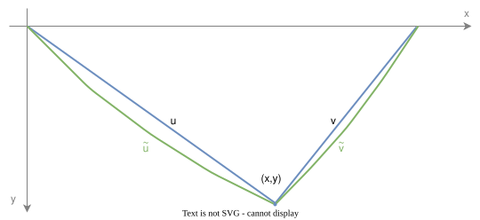
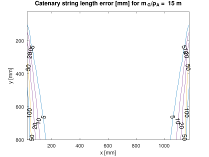
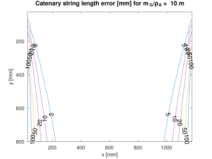
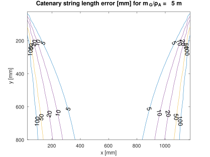

# Catenary error

To visualize the catenary effect, an arbitrary target gondola position $(x,y)$ is chosen. Neglecting the stepper wheel radius, the string lengths for the straight line idealization $[u,v]$ and the string lengths with catenary $[\tilde u,\tilde v]$ are calculated.

[Octave/MATLAB simulation](../math/plot_catenaryerr.m)

Contour plots of the string length error's Euclidean distance for an exemplary board with stepper distance $L$ of 1.2 m and different gondola mass to string linear mass density ratios are shown below.

  

**Interpretation:**
- As expected, an extra string length is relevant for small ratios, i.e. for light weight gondolas on heavy strings
- A ratio of 10m means, that the gondola has the weight of 10 meter string length
- The string length itself is a function of stepper distance and gondola position - the contour plots do not just linearly scale with geometrical dimensions, as the strings' lengths will increase with board size
- Gravity acceleration pares down, so catenary effect os the same on earth and on the moon

[<- back](kinematics.md)

---

Shield: [![CC BY-NC-SA 4.0][cc-by-nc-sa-shield]][cc-by-nc-sa]

This work is licensed under a
[Creative Commons Attribution-NonCommercial-ShareAlike 4.0 International License][cc-by-nc-sa].

[![CC BY-NC-SA 4.0][cc-by-nc-sa-image]][cc-by-nc-sa]

[cc-by-nc-sa]: http://creativecommons.org/licenses/by-nc-sa/4.0/
[cc-by-nc-sa-image]: https://licensebuttons.net/l/by-nc-sa/4.0/88x31.png
[cc-by-nc-sa-shield]: https://img.shields.io/badge/License-CC%20BY--NC--SA%204.0-lightgrey.svg
