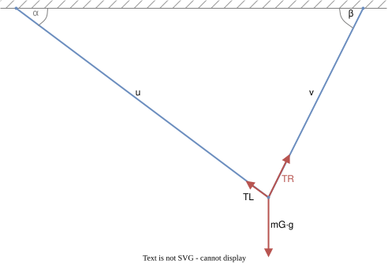
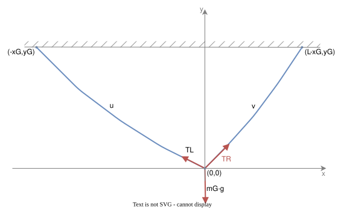

# String tension
In the ideal kinematics model, gravity affects the gondola mass $m_G$ only. 

Assuming stationary gondola position, the string tensions $T_L$ (left string) and $T_R$ (right) are then derived from a force equilibrium

- horizontal component: $T_L\cdot\cos\alpha = T_R\cdot\cos\beta$
- vertical component: $T_L\cdot\sin\alpha + T_R\cdot\sin\beta = m_G\cdot g$

with gravity constant $g$ and gondola mass $m_G$, resulting in

$$T_L = \frac{m_G\cdot g\cdot\cos\beta}{\sin\alpha \cos\beta + \sin\beta \cos\alpha}$$
$$T_R = \frac{m_G\cdot g\cdot\cos\alpha}{\sin\alpha \cos\beta + \sin\beta \cos\alpha}$$

# Catenary
Considering their distributed mass, the ideal straight line strings will in practice sag, leading to a catenary and another transformation error.
It turns out that a gondola-centric coordinate system $(x,y)$ simplifies the analysis, so we transform coordinates by

$$x=x_G+X, \quad y=y_G-Y$$

The left stepper is then located at $(-x_G,y_G)$, right stepper at $(L-x_G,y_G)$.

For derivation of the string line, we observe an infinitesimal segment, described by its deltas $dx$ in horizontal and $dy$ in vertical direction. Its length is 

$$ds=\sqrt{dx^2+dy^2}=\sqrt{1+\left(\frac{dy}{dx}\right)^2}\cdot dx$$

and gravity causes a vertical force of amount $dq = g\cdot\rho_A\cdot ds$ on it, where $\rho_A$ describes the linear mass density. 
As stationary gondola position is assumed, the horizontal tension component $H$ is constant.
The vertical tension component $V=H\cdot\frac{dy}{dx}$ is increased according to $V(x+dx)=V(x)+dq$. All this leads to the differential equation

$$\frac{d^2y}{dx^2} = \frac{g\cdot\rho_A}{H}\cdot\sqrt{1+\left(\frac{dy}{dx}\right)^2}$$

which is solved by hyperbolic cosine functions. 

**Solving the differential equation:**

Following a generic approach, we describe the line on the left string by the unknown integration constants $c_0$, $c_1$, on the right string by $c_2$, $c_3$:
 
$$y_L = \frac{H}{g\cdot\rho_A}\cosh\left(\frac{g\cdot\rho_A}{H}x+c_1\right) + c_0$$
$$y_R = \frac{H}{g\cdot\rho_A}\cosh\left(\frac{g\cdot\rho_A}{H}x+c_3\right) + c_2$$

The lines' slope are then given by their derivatives

$$\frac{dy_L}{dx} = \sinh\left(\frac{g\cdot\rho_A}{H}x+c_1\right)$$
$$\frac{dy_R}{dx} = \sinh\left(\frac{g\cdot\rho_A}{H}x+c_3\right)$$

Using the boundary condition at the gondola $y_L(0)=y_R(0)=0$, the integration constants $c_0$ and $c_2$ can be replaced by 

$$c_0 = -\frac{H}{g\cdot\rho_A}\cosh(c_1), \quad c_2 = -\frac{H}{g\cdot\rho_A}\cosh(c_3)$$

Evaluating the vertical tension equilibrium at the gondola $-H\cdot\sinh(c_1) + H\cdot\sinh(c_3) = m_G\cdot g$, the horizontal tension component $H$ is also related to $c1$ and $c3$.

Finally, the equation system can be numerically solved using the left and right mounting boundary conditions 

$$y_L(-x_G) = y_G, \quad y_R(L-x_G) = y_G$$

or alternatively under consideration of the stepper wheel radius and neglecting a shift in lift-off point due to catenary

$$y_L(-x_G+R\cos\alpha) = y_G+R\sin\alpha, \quad y_R(L-x_G-R\cos\beta) = y_G+R\sin\beta$$

The adjusted strings' length are then given by

$$u = \int_{-x_G}^0\sqrt{1+\left(\frac{dy_L}{dx}\right)^2}dx = \frac{H}{g\cdot\rho_A}\cdot\left(\sinh(c_1) - \sinh\left(\frac{g\cdot\rho_A}{H}\cdot(-x_G)+c_1\right)\right)$$
$$v = \int_0^{L-x_G}\sqrt{1+\left(\frac{dy_R}{dx}\right)^2}dx = \frac{H}{g\cdot\rho_A}\cdot\left(\sinh\left(\frac{g\cdot\rho_A}{H}\cdot(L-x_G)+c_3\right) - \sinh(c_3)\right)$$

Its impact is visualized [here](catenaryerr.md).

