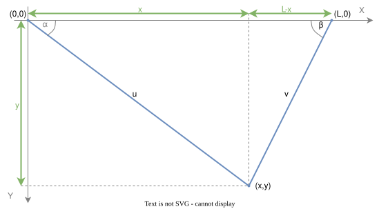
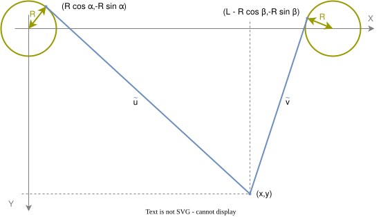

# Basic math
The ideal V plotter model has the following geometry

In my board-fixed orthogonal coordinate setup $(X,Y)$, the left stepper defines the origin $(0,0)$, the right stepper is located in distance $L$ on the same horizontal line, so at $(L,0)$. 

Locating the gondola at $(x,y)$ is equivalent to a pair of string lengths $[u,v]$, where $u$ defines the distance between the left stepper and the gondola, and $v$ that between the right stepper and the gondola.

The string lengths are then given by Pythagoras 

$$u=\sqrt{x^2+y^2}$$
$$v=\sqrt{(L-x)^2+y^2}$$

or in other words, the transformation between gondola coordinates $(x,y)$ and string lengths $[u,v]$ is non-linear.

As strings can only hold tension forces, it is obvious that gondola positions are restricted to
$$0\leq x\leq L,\quad y\geq0$$

Under these restrictions, the transformation is biunique and can be inverted:

$$x=\frac{u^2-v^2+L^2}{2L}$$
$$y=\frac{\sqrt{2u^2v^2+2u^2L^2+2v^2L^2-u^4-v^4-L^4}}{2L}$$

This already enables a [sensitivity analysis](sensitivity.md) that shows the impact of string length steps on coordinate resolution, depending on the current gondola position.

To complete geometric description, the ideal string angles to horizontal are given by
$$\alpha=\arctan(y/x),\quad\beta=\arctan(y/(L-x))$$

# Stepper wheel radius
De-idealizing the punctional upper string mounting, the stepper wheel radius $R$ causes a transformation error. The V plotter changes its geometry to

The strings' upper positions are now given by their tangential lift-off positions $(R\cos\alpha, -R\sin\alpha)$ and $(L-R\cos\beta, -R\sin\beta)$, where $\alpha$ and $\beta$ are the ideal string angles to horizontal, related to gondola position $(x,y)$ and stepper distance $L$:

$$\cos\alpha=\frac{x}{\sqrt{x^2+y^2}},\quad\sin\alpha=\frac{y}{\sqrt{x^2+y^2}},$$
$$\cos\beta=\frac{L-x}{\sqrt{(L-x)^2+y^2}},\quad\sin\beta=\frac{y}{\sqrt{(L-x)^2+y^2}}$$

Again, Pythagoras is applied to determine the corrected strings' length

$$\tilde u=\sqrt{x^2\cdot(1-\frac{R}{\sqrt{x^2+y^2}})^2+y^2\cdot(1+\frac{R}{\sqrt{x^2+y^2}})^2},$$
$$\tilde v=\sqrt{(L-x)^2\cdot(1-\frac{R}{\sqrt{(L-x)^2+y^2}})^2+y^2\cdot(1+\frac{R}{\sqrt{(L-x)^2+y^2}})^2}$$

Using the above transformation totally removes the stepper wheel radius error. 
Its impact is visualized [here](wheelerr.md).
There is no closed-form analytical inverse transformation, if necessary use a [numerical approximation](inv-transform-approx.md)

Gondola positions are now restricted to
$$R\leq x\leq (L-R),\quad y\geq-R$$

---

Shield: [![CC BY-NC-SA 4.0][cc-by-nc-sa-shield]][cc-by-nc-sa]

This work is licensed under a
[Creative Commons Attribution-NonCommercial-ShareAlike 4.0 International License][cc-by-nc-sa].

[![CC BY-NC-SA 4.0][cc-by-nc-sa-image]][cc-by-nc-sa]

[cc-by-nc-sa]: http://creativecommons.org/licenses/by-nc-sa/4.0/
[cc-by-nc-sa-image]: https://licensebuttons.net/l/by-nc-sa/4.0/88x31.png
[cc-by-nc-sa-shield]: https://img.shields.io/badge/License-CC%20BY--NC--SA%204.0-lightgrey.svg
