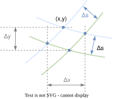
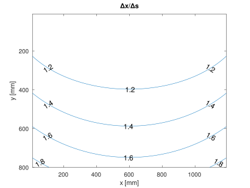
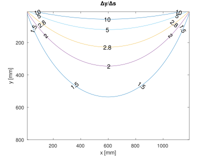

# Sensitivity analysis
Due to non-linearity of the transformation, the gondola position reacts with different sensitivity on string length changes.

To show this effect numerically in the simple model, the string lengths $[u,v]$ to locate the gondola at an arbitrary position $(x,y)$ are subsequently incremented by a step $\Delta s$, resulting in 3 more locations.
The largest distance of these 4 points in $x$ and $y$ direction is then used as a measure of sensitivity.

[Octave/MATLAB simulation](../math/plot_sensitivity.m)

The ratios $\Delta x / \Delta s$ and $\Delta y / \Delta s$ for an exemplary board with stepper distance $L$ of 1.2 m are shown as contour plot below.

 

**Interpretation:**
- The sensitivity on $y$ is dominant
- Assuming a minimum string length step of 1 mm, a single step on both strings at the contour line 10 causes a movement of 10 mm in $y$ direction
- The contour line 2.8 corresponds to the "40% change" recommendation in [^1]

[<- back](math.md)

[^1]: https://www.2e5.com/plotter/V/design/