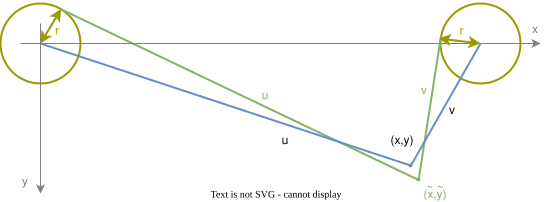
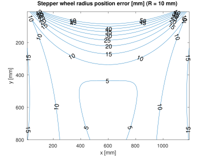
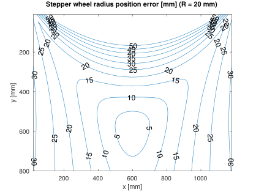
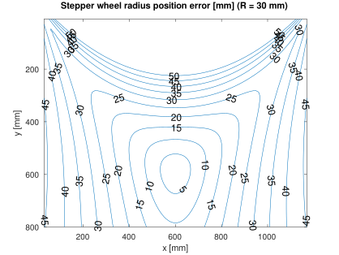

# Stepper wheel radius error

To visualize the effect, an arbitrary target gondola position $(x,y)$ is chosen, the string lengths $[u,v]$ in the ideal system ($R=0$) are calculated and then back-transformed to the gondola position $(\tilde x,\tilde y)$ with stepper wheel radius correction.

[Octave/MATLAB simulation](../math/plot_wheelerr.m)

Contour plots of the position error's Euclidean distance for an exemplary board with stepper distance $L$ of 1.2 m and different wheel radii are shown below.

  

**Interpretation:**
- The wheel radius error is relevant at the left, right and upper border of the draw plane
- The larger the wheel radius $R$ in relation to stepper distance $L$, the larger the error

[<- back](math.md)
